# Getting Started with Twitter Bootstrap

## Introduction

Last week I wrote a post on how to [get started with GitHub](https://github.com/geersch/GettingStartedWithGitHub). It was part of a session I presented during a company trip early September. The second part of the session showed how you can quickly setup an ASP.NET MVC application and integrate [Twitter Bootstrap](http://twitter.github.com/bootstrap/) into it.

For those not familiar with Bootstrap, it is a collection of CSS and HTML conventions for helping you out with typograpghy, forms, buttons, navigations...etc. Included as well is a collection of (optional) JavaScript extensions.

## Download

Download the latest version of [Twitter Bootstrap](http://twitter.github.com/bootstrap/). Go ahead and click the big download button. It'll download one archive called bootstrap.zip. You can also [customize the Twitter Bootstrap download](http://twitter.github.com/bootstrap/customize.html). Choose the components, jQuery plugins and default look and feel. But for now, the default package will do.

The archive contains a folder called "bootstrap", which in turn contains 3 sub-folders.

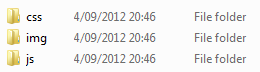

- The **css** folder contains 2 cascasding stylesheets:
  - bootstrap.css (+ bootstrap.min.css)
  - bootstrap-responsive.css (+ bootstrap-responsive.min.css)
- The **js** folder contains 1 JavaScript library:
  - bootstrap.js (+ bootstrap.min.js)
- The **img** folder contains 2 images:
  - glyphicons-halflings.png
  - glyphicons-halflings-white.png

As you can see both a debug and a minified version of the stylesheets and JavaScript library have been included. The glyphicons-halflings.png image contains about 140 icons. The glyphicons-halflings-white.png is just a white variant of the icons. Bootstrap uses the icons from [GLYPHICONS](http://glyphicons.com/). They are referenced in the stylesheets.

**Remark**: If you customize the download you'll get the same files, but the bootstrap.css and bootstrap-responsive.css have been merged into one file (bootstrap.css). The contents of the bootstrap-responsive.css files have been appended to the bootstrap.css file.

## ASP.NET MVC Project

Integrating Twitter Bootstrap into an ASP.NET MVC site is a piece of cake. Let's quickly iterate through the necessary steps. Start Visual Studio and create an new ASP.NET MVC 4 project (empty template), called TwitterBootstrap. Afterwards you should see the following files in your Solution Explorer.

")

Extract the bootstrap.zip you downloaded earlier and copy the css, js and image folders into the root of the web application.

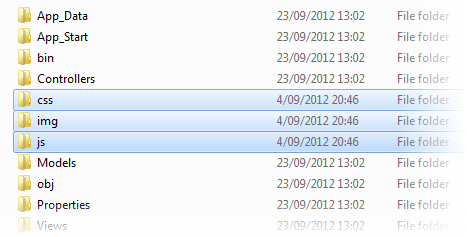

Back in the Solution Explorer click the "Show All Files" button and include the 3 new folders into your project.

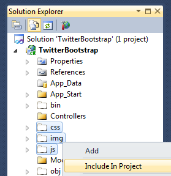

You also need to download the latest [jQuery](http://jquery.com/) version. Save it in the js folder and include it in your project.

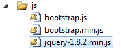

## Bootstrapping a Site

The ASP.NET MVC project now includes all the necessary Bootstrap resources. Let's create a page which contains a Bootstrap component.

Add a basic master layout (Views\\Shared\\\_master.cshtml) to the project. Add a new folder called Shared to the Views folder and add a new view named \_master to it.

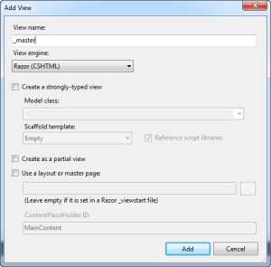

A basic page containing some boilerplate HTML will be generated for you. Make sure the DOCTYPE declaration is set to the HTML 5 DOCTYPE as Bootstrap uses certain HTML 5 tags.

```html
<!DOCTYPE html\>
```

Include bootstrap.css (or bootstrap.min.css) and jQuery in the HEAD element.

```html
<head>
    <title>Twitter Bootstrap</title>
    <link href="@Url.Content("~/css/bootstrap.css")" rel="stylesheet" type="text/css" />
    <script src="@Url.Content("~/js/jquery-1.8.2.min.js")" type="text/javascript"></script>
</head>
```

Just before you close the BODY element include the bootstrap.js (or bootstrap.min.js) file.

```html
<body>
...
<script src="@Url.Content("~/js/bootstrap.min.js")"></script>
</body>
```

Alright, we've got a basic master layout now. We need to add at least one page. Add a new controller, HomeController, to the Controllers folder. Make sure the controller has one actoin method called Index.

```csharp
public class HomeController : Controller
{
    public ActionResult Index()
    {
        return View();
    }
}
```

Next add a new folder called Home to the Views folder and add a view named Index into this new folder. When creating the view select the \_master.cshtml page as its master page.

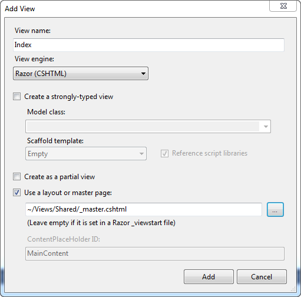

OK, one remaining task. You've got to add the @RenderBody() method somewhere on the \_master.cshtml page in order to render the Index view.

For example:

```html
<body>
  <div>@RenderBody()</div>
  ...
</body>
```

If you compile and run the project you should get the following output:

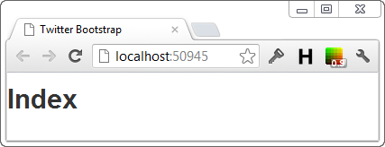

## Navbar Component

Now we can finally start using Twitter Bootstrap. Let's demonstrate it using Bootstrap's [Navbar component](http://twitter.github.com/bootstrap/components.html#navbar).

Just copy the following HTML directly below the BODY's opening tag in the \_master.cshtml file.

```html
<div class="navbar">
  <div class="navbar-inner">
    <div class="container">
      <button
        type="button"
        class="btn btn-navbar"
        data-toggle="collapse"
        data-target=".nav-collapse"
      >
        <span class="icon-bar"></span>
        <span class="icon-bar"></span>
        <span class="icon-bar"></span>
      </button>
      <a class="brand" href="#">Euricom</a>
      <div class="nav-collapse">
        <ul class="nav">
          <li class="active"><a href="#">GitHub</a></li>
          <li><a href="#">Bootstrap</a></li>
          <li><a href="#">MongoDB</a></li>
          <li><a href="#">Knockout</a></li>
          <li><a href="#">AppHarbor</a></li>
        </ul>
      </div>
    </div>
  </div>
</div>
```

It's just a div containing a list of menu items. A couple of Bootstrap CSS classes are used here (navbar, navbar-inner, brand, nav, active). Bootstrap takes care of the rest and turns into a beautiful navigation bar. Go ahead and run it.

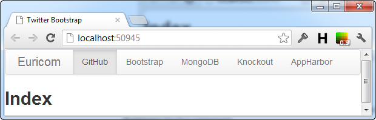

Bootstrap contains a a chuckload components, JavaScript plugins...etc. which you can readily use. Just check out the [Twitter Bootstrap site](http://twitter.github.com/bootstrap) to discover them.

## Responsive Design

Just one last thing I want to address is the responsive design of Bootstrap. If you run the web application now and resize the browser to a small size you'll get the following effect:

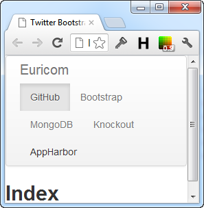

Readable, but not really a nice effect. Let's remedy this. You only need to do one thing to achieve this. Include the bootstrap-responsive.css (or bootstrap-responsive.min.css) file just below the bootstrap.css link in the HEAD section.

```html
<link href="@Url.Content("~/css/bootstrap-responsive.css")" rel="stylesheet"
type="text/css" />
```

Refresh the page.

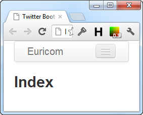

The menu items have been hidden (collapsed). Instead a button is shown. You can click this button to toggle the menu items.

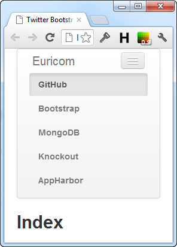

Very easy if you quickly want to create a site which renders nicely on a desktop, tablet or smart phone.

If you take a look at the HTML code for the navbar you'll notice that it contains a button which is initially hidden if the browser window is large enough, but is shown once the viewport is too small too display all the menu items.

Notice the HTML5 data- attribute (data-toggle) on the button. The menu items on the other hand are contained within a div that has the css class nav-collapse attributed to it. Using this information Bootstrap knows it should hide the menu items and show the button once the viewport is too small.

**Remark**: If you want to include your own CSS file, it's best to insert it between the bootstrap.css and bootstrap-responsive.min.css file to prevent the responsive part of Bootstrap from messing up your custom style.

I hope you enjoyed this quick introduction to [Twitter Bootstrap](http://twitter.github.com/bootstrap). Be sure to check it out in more detail. It's very easy and contains a ton of useful components, plugins...etc.
